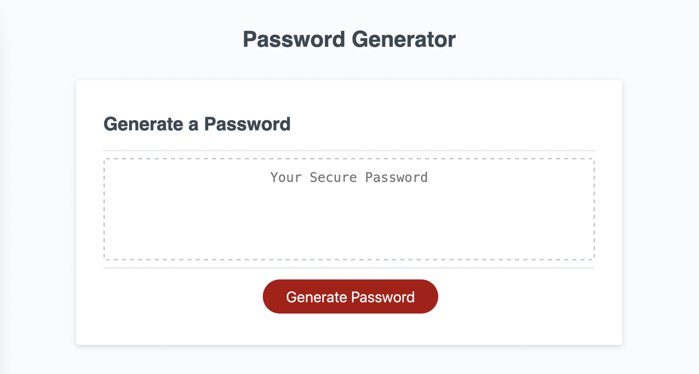

# Password Generator

## Description

This is a web page that generates a random password based on parameters that the user provides in response to prompts from the page. The user may choose to include lower-case letters, upper-case letters, numerical characters, or special characters.

If the user's responses to the prompts are in some way invalid, they are "rewarded" with a pithy error message.

You can access the page at [this location](https://lkalliance.github.io/module-3-challenge/).

## Usage

The page has a display box, and a "Generate Password" button. Upon clicking the button, the user is given four prompts to identify what kinds of characters they would like to be used for their password:

1. lower-case letters
2. UPPER-CASE LETTERS
3. Numerical characters
4. Special characters

On each prompt, they are instructed to click "OK" for yes and "Cancel" for no. Special characters are defined in an array in the javascript, which can be edited by the programmer as needed to reflect the acceptable character set.

The user's selections are validated to ensure they have selected at least one character set. If they haven't, an error message is sent to the display box, and the user is invited to try again.

If the set of character types is validated, then the user is given a request for the length of the password. The number is then validated two ways: it needs to be between 8 and 128, and it needs to be made up of actual numerical digits and no other text characters. If it fails either validation, an error message is sent to the display box, and the user is invited to try again.

If the user's inputs pass all validation, then the page assembles a random password within the provided criteria, and sends it to the display box.

On non-mobile browsers only, once a password is successfully generated, a click anywhere in the display box will automatically select the password so the user can copy it. This feature does not work with mobile browsers.

## Installation

There are no installations necessary for this page to operate. It currently uses just HTML, CSS and Javascript; technologies that are built into any web browser. The browser DOES need to have Javascript enabled.

## Credits

I refactored code created by a previous developer, whose identity remains a secret. The HTML and CSS, plus some very basic Javascript, were provided by this mystery coder. I created the Javascript functions to request the criteria from the user, to validate them, and to either produce and present the password or to give an error message.

I brainstormed and devised all the error messages. Some of them reference movies and works of literature:

- _2001: A Space Odyssey_ (screenplay by Stanley Kubrick and Arthur C. Clarke, directed by Stanley Kubrick)
- _The Princess Bride_ (screenplay by William Goldman, directed by Rob Reiner)
- _Casablanca_ (screenplay by Julius Epstein, Philip Epstein and Howard Koch; directed by Michael Curtiz)
- _Kubla Khan_ (poem written by Samuel Taylor Coleridge)
- _Who's Afraid of Virginia Woolf?_ (written by Edward Albee)
